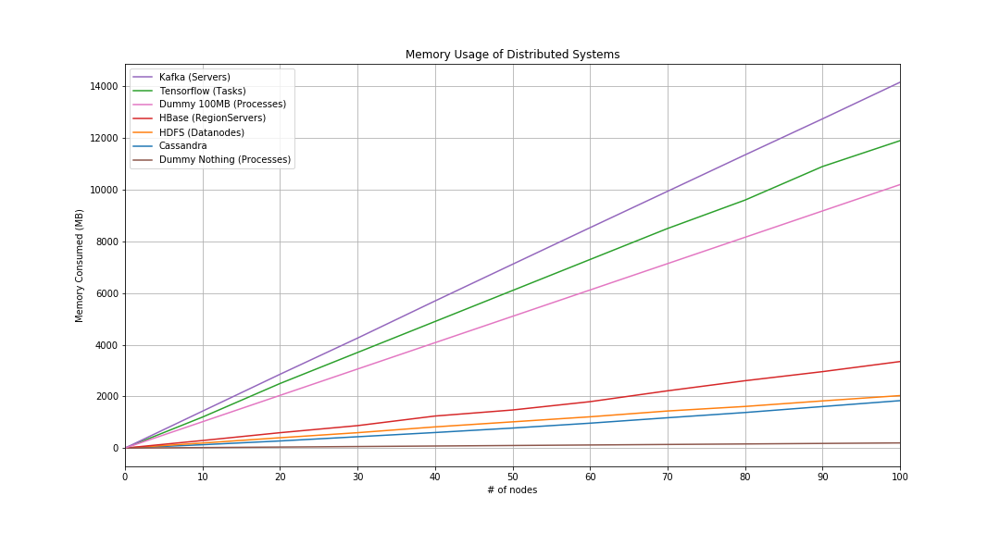

# ucare-research

Projects containing all of my UCARE Research

## Projects

### 1. Load balancing

- [Cassandra Single Policy](https://github.com/rayandrews/ucare-research/tree/master/cassandra-single-policy)

### 2. Memory Deduplication

- [Madvise-KSM in C](https://github.com/rayandrews/ucare-research/tree/master/madvise-ksm-c)
- Java-KSM **Planned**

### 3. Memory Usage Tracker

- [Cassandra](https://github.com/rayandrews/ucare-research/tree/master/memory-tracking/cassandra)
- [HDFS](https://github.com/rayandrews/ucare-research/tree/master/memory-tracking/hdfs)
- [Tensorflow](https://github.com/rayandrews/ucare-research/tree/master/memory-tracking/tensorflow)
- [HBase](https://github.com/rayandrews/ucare-research/tree/master/memory-tracking/hbase)
- [Kafka](https://github.com/rayandrews/ucare-research/tree/master/memory-tracking/kafka)

## Result

### Memory Usage Tracker

### More to come..

## Author

- Ray Andrew <raydreww@gmail.com>
- Cesar Stuardo
