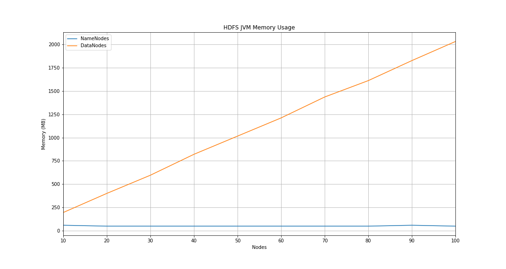

# HDFS Memory Usage

## Installation

1. Install JDK7 (using zulu)

```bash
sudo ./install-jdk7.sh
```

2. Install Maven

```bash
sudo ./install-maven.sh
```

3. Install Protobuf

```bash
sudo ./install-protobuf.sh
```

## Running

1. Source env

```bash
source ./env.sh
```

2. Run Hadoop

```bash
./run-hadoop.sh start N # N is number of datanodes
```

3. Run reader

```bash
touch data.txt
python3 reader.py -adn Nx >> data.txt # Nx is (number of datanodes - 1)
```

4. Plot the data

```bash
jupyter lab # open Visualization.ipynb
```

## Results


