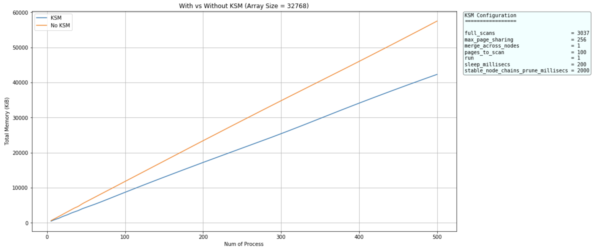

# Madvise KSM simulation

## DevNotes

See [DEVNOTES.md](DEVNOTES.md) for more info about this implementation

Inspired by this [posts](http://www.metaklass.org/linux-ksm-madvise/) by Jorge Niedbalski

## Compile

```sh
make
```

## Run

1. KSM (With Madvise)

```
make run-with-madvise array_size=${array_size} num_process=${num_process}
```

2. No KSM (Without Madvise)

```
make run-without-madvise array_size=${array_size} num_process=${num_process}
```

## Profiling

**Prerequisite** : Install [ps_mem](https://github.com/pixelb/ps_mem)

**Notes** : Run this after some delay (about 3-5 seconds) until all process has been running

1. KSM (With Madvise)

```
make profiling-with-madvise array_size=${array_size} num_process=${num_process}
```

2. No KSM (Without Madvise)

```
make run-without-madvise  =array_size=${array_size} num_process=${num_process}
```

## Results


