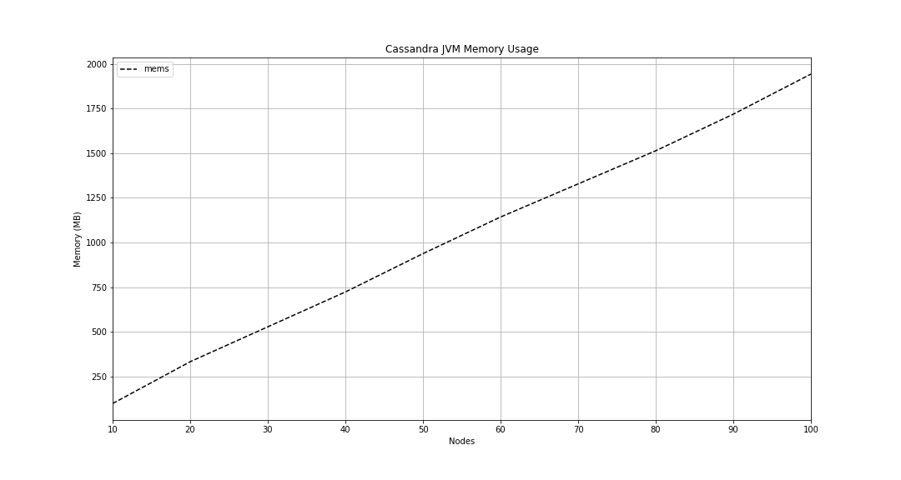

# Cassandra Memory Usage

This project uses [CCM](https://github.com/riptano/ccm) by Riptano

## Installation

1. Building cassandra

```bash
ant
```

## Running

1. Run CCM

```bash
python3 deploy.py \
  --node_count N \
  --cassandra_dir CASSANDRA_DIR \
  --cluster_name CLUSTER_NAME \
  --cluster_path CLUSTER_PATH >> log.txt
```

or background task

```bash
nohup python3 deploy.py \
  --node_count N \
  --cassandra_dir CASSANDRA_DIR \
  --cluster_name CLUSTER_NAME \
  --cluster_path CLUSTER_PATH >> log.txt &
```

3. Preprocess the data

Just copy paste it to the csv or create the script

4. Plot the data

```bash
jupyter lab # open Visualization.ipynb
```

## Results


