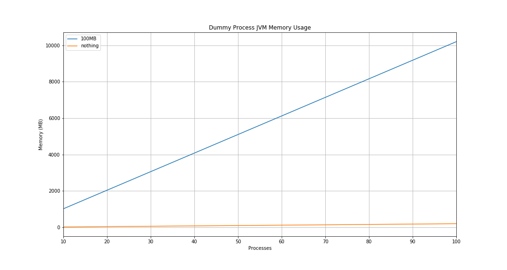

# Dummy Process Memory Usage

Only sleeps..

## Installation

1. Install JDK8 and Python3

```bash
sudo ./install-java-python.sh
```

2. Install Gradle

```bash
sudo ./install-gradle.sh
```

3. Source env

```bash
source ./env.sh
```

4. Install kafka

```bash
./build-dummy.sh
```

## Running

1. Source env

```bash
source ./env.sh
```

2. Run Kafka

```bash
./run.sh N # N is number of processes
```

3. Run reader

```bash
python3 reader.py -n N # N is number of processes
```

4. Plot the data

```bash
jupyter lab # open Visualization.ipynb
```

## Results


