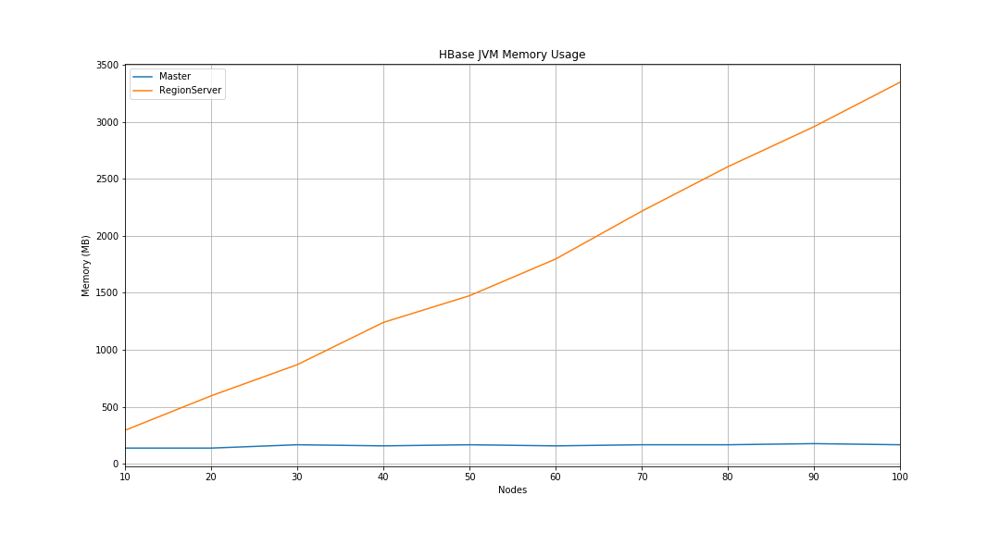

# HBase Memory Usage

## Installation

1. Install HBase

```bash
./install-hbase.sh
```

## Running

1. Source env

```bash
source ./env.sh
```

2. Run HBase

```bash
./run-hbase.sh start N # N is number of Region Server
```

3. Run reader

```bash
touch log.txt
python3 reader.py -ars N >> log.txt # N is number of Region Server
```

4. Kill java process

```bash
killall -s 9 java
```

5. Plot the data

```bash
jupyter lab # open Visualization.ipynb
```

## Results


