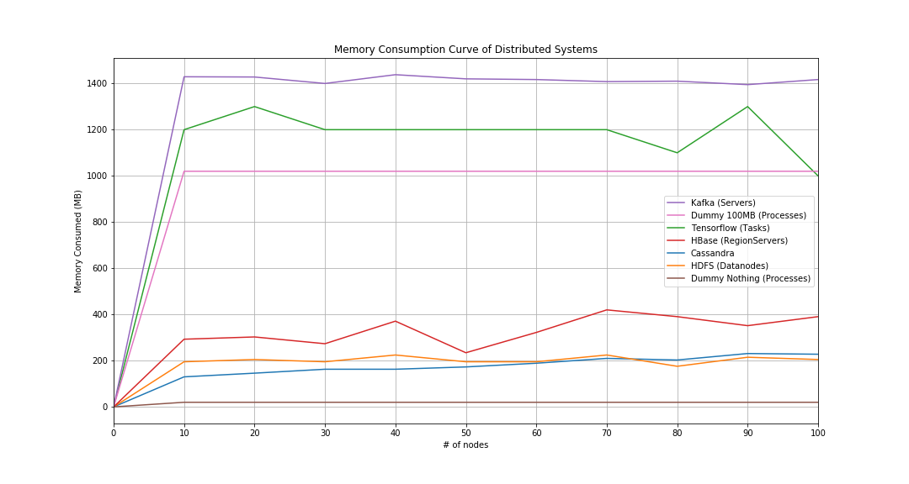

# Visualization Memory Usage

This project uses matplotlib to plot memory usage of distributed systems

## Distributed Systems

- [x] Cassandra
- [x] HDFS
- [x] HBase
- [x] Tensorflow Distributed
- [x] Kafka
- [x] Dummy Process
- [ ] ...

## Running

```bash
jupyter lab
```

## Results



