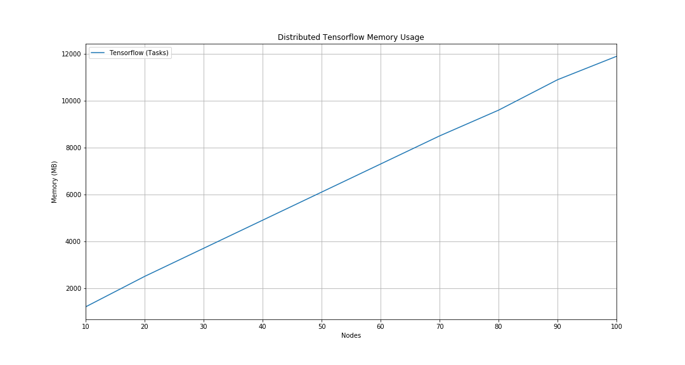

# Distributed Tensorflow Memory Usage

## Installation

1. Installing Tensorflow

```bash
sudo pip3 install --upgrade https://storage.googleapis.com/tensorflow/linux/cpu/tensorflow-1.1.0-cp34-cp34m-linux_x86_64.whl
sudo pip3 install ps_mem
```

## Running

1. Run Cluster

```bash
./run.sh N # N is number of nodes
```

2. Run the reader

```bash
sudo ps_mem -p $(pgrep -d, -f python)
```

## Results


