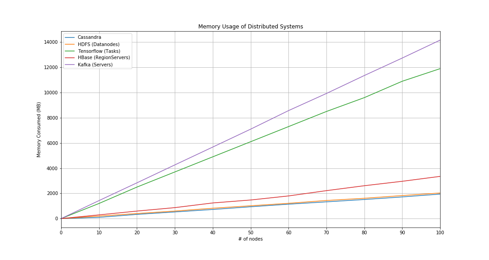

# Visualization Memory Usage

This project uses matplotlib to plot memory usage of distributed systems

## Distributed Systems

- [x] Cassandra
- [x] HDFS
- [ ] HBase
- [ ] Tensorflow Distributed
- [ ] ...

## Running

```bash
jupyter lab
```

## Results


